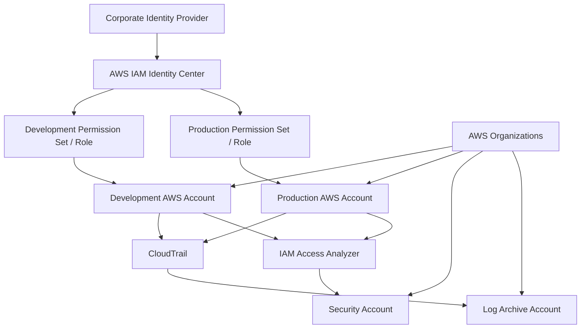

# Enterprise IAM Architecture

## Target Operating Model

A mature AWS environment separates identities, workloads, and security responsibilities across accounts and organizational boundaries.

## Design Decisions

### 1. Centralized Workforce Identity

Use IAM Identity Center with an enterprise identity provider when possible. This creates centralized account access and reduces the need for separate IAM users in every AWS account.

### 2. Multi-Account Isolation

Separate development, production, security, and logging responsibilities into different AWS accounts as the environment grows. AWS accounts provide strong operational, billing, quota, and security boundaries.

### 3. Permission Sets and Roles

Grant job-function access with permission sets and roles rather than permanent administrator credentials.

### 4. Guardrails

Use AWS Organizations policies to define the maximum operating envelope across accounts. Guardrails do not replace task-level IAM permissions; they constrain them.

### 5. Central Logging

Send audit events to a controlled logging location. Security personnel should be able to investigate access independently of workload administrators.

## Separation of Duties Example

| Function | Typical Responsibility | Should Not Automatically Include |
|---|---|---|
| Developer | Build and operate non-production workloads | Organization-wide IAM administration |
| Production Operator | Deploy approved production changes | Security log deletion |
| Security Administrator | Manage guardrails and investigations | Routine application development |
| Auditor | Read logs/configuration | Write access to workloads |

## Enterprise Principle

A secure AWS environment is not one administrator with `AdministratorAccess`. It is a collection of controlled roles with defined trust relationships, scoped permissions, monitoring, and escalation paths.
